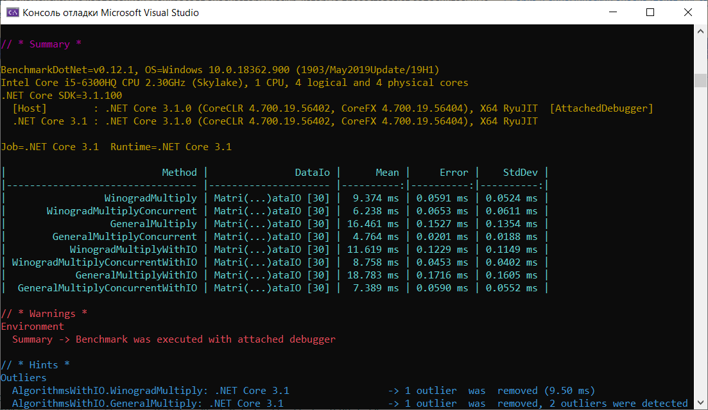
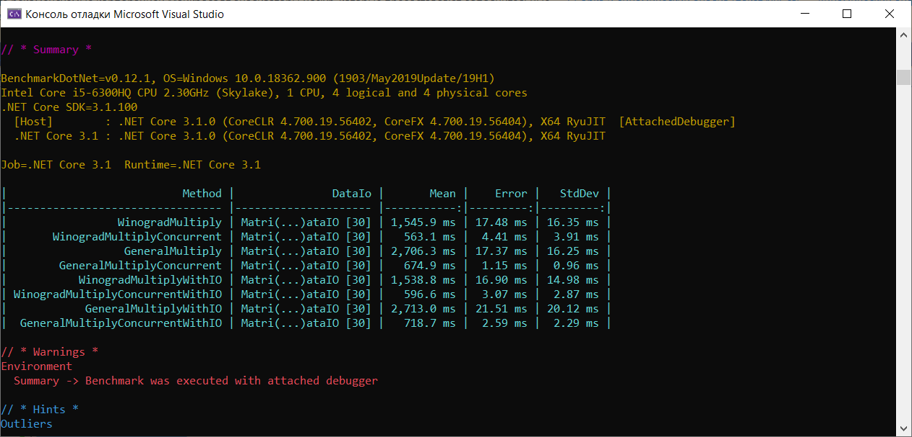
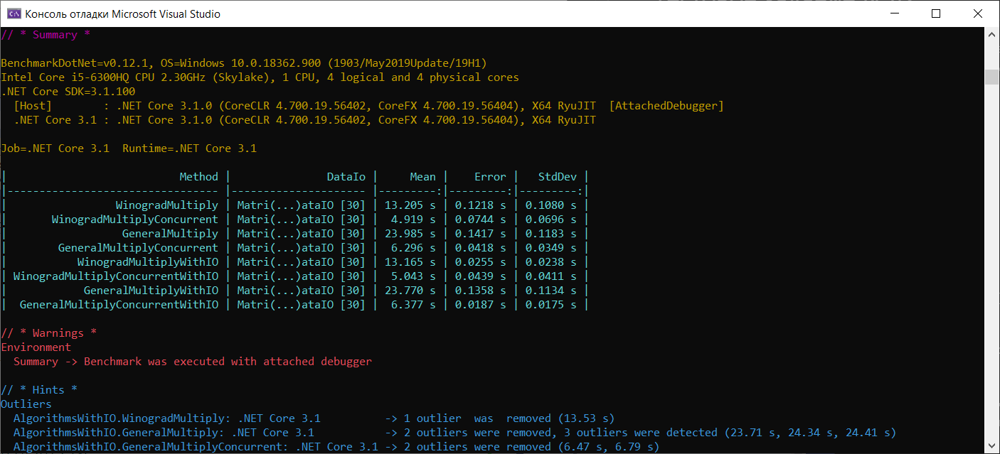
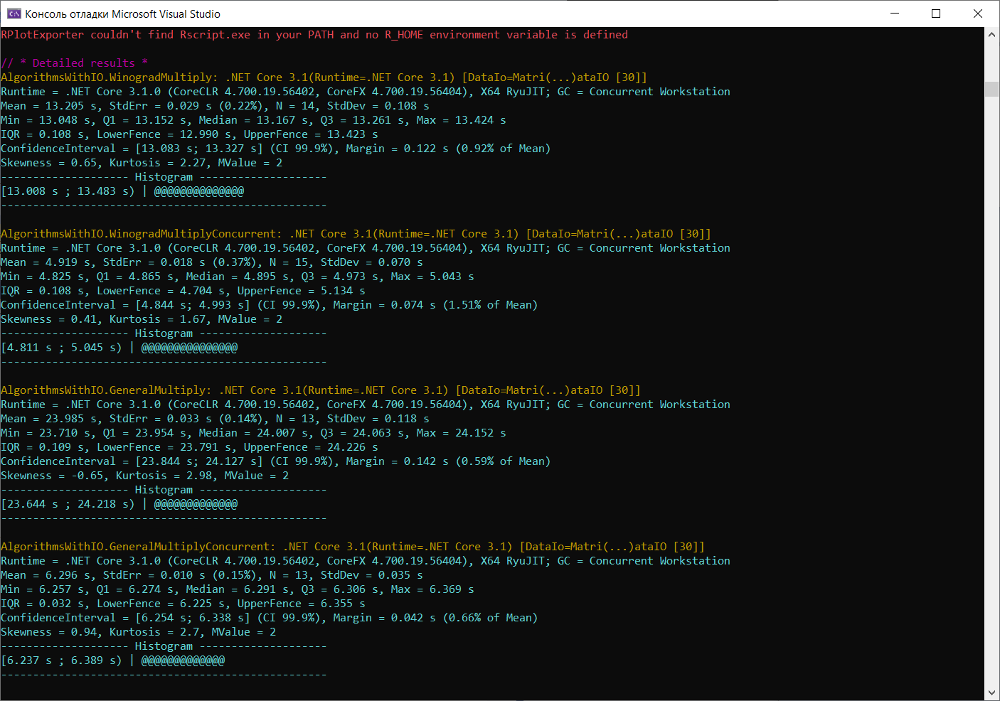
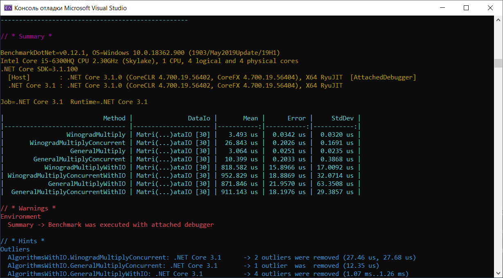
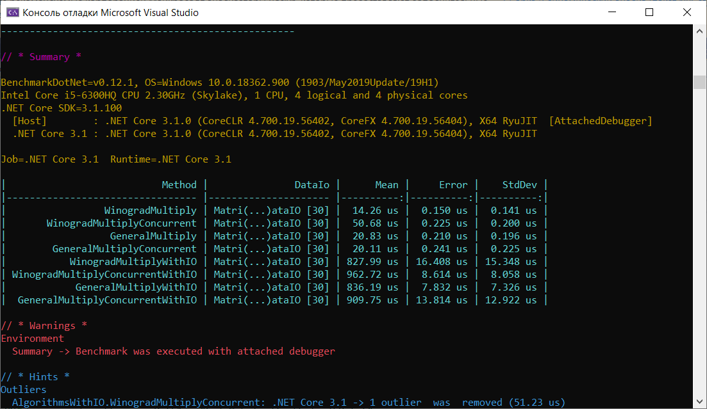
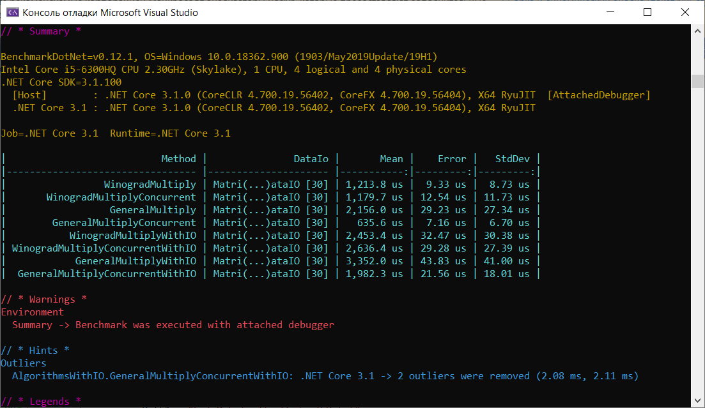

# Тестовое задание №42

Написать функцию для многопоточного перемножения 2 квадратных матриц. Выяснить порог размеров матриц (округлить до 100), при котором многопоточный вариант быстрее однопоточного.

**Платформа .NetCore 3.1**

#### Входные данные
* srcPath1 - имя файла с первой матрцией
* srcPath2 - имя файла со второй матрицей
* dstPath - имя файла с результирующей матрицей

**Формат файлов**

Бинарные файлы, первые 4 байта - размер матрицы N (int32). Следующие `8*N*N байт` - ячейки матрицы (double), записанные слева направо, сверху вниз.

**Бонус (необязательно):** измерить производительность однопоточного и многопотчного вариантов.

- Измерения производительности проводить с помощью библиотеки [BenchmarkDotNet](https://github.com/dotnet/BenchmarkDotNet)
- Измерить 2 варианта: только вычисления и вычисления вместе с вводом/выводом. Для размеров матриц 100, 500, 1000, 5000, 10000
- Результы измерений вставить в README и вместе с проектом положить на гитхаб
- Генератор файлов и однопоточный вариант также положить в проекте рядом.

___
# Результаты выполнения задания

Для анализа времени выполнения перемножения матриц и влияния операций ввода-вывода на скорость работы программы, были выбраны алгоритм перемножение 2 матриц по определению с асимптотикой O(n^3) и алгоритм умножения матриц по Виноградову с асимптотикой O(n^2.3727). Эти алгоритмы реализуются в однопоточном и многопоточном варианте.

Тесты на матрицах 100х100, 500х500, 1000х1000 показали существенное преимущество многопоточных алгоритмов над однопоточными, а также доказали лучшую асимптотику работы алгоритма Виноградова, чем у алгоритма по определению.

### Анализ скорости алгоритмов на матрицах 100х100

### Анализ скорости алгоритмов на матрицах 500х500

### Анализ скорости алгоритмов на матрицах 1000х1000

#### Подробная информация по анализу скорости на матрицах 1000х1000 

### Анализ скорости алгоритма на 5000х5000 и 10000х10000

Алгоритм Виноградова в многопоточном варианте перемножает матрицы размером 5000х5000 приблизительно за 12-14 мин. Другие алгоритмы на матрицах подобных размеров будут работать неприемлемо долго, а алгоритм Виноградова отработает матрицы 10000х10000 приблизительно за несколько часов. Для сравнения производительности однопоточной и многопоточной реализации достаточно матриц размером 1000х1000, поэтому результаты работы при больших размерах на скриншотах не приводятся.

## Вывод
Уже на размере матриц 100х100 заметно преимущество многопоточного вычисления произведения матриц над однопоточным. Поэтому проанализируем скорость работы алгоритмов на матрицах размером 5х5, 10х10, 50х50

##### Анализ скорости алгоритмов на матрицах 5х5

Заметим, что самым быстрым алгоритмом на маленьких матририцах является однопоточный алгоритм по определению. Это связано с отсутствием необходимости выделения дополнительной памяти для алгоритма Виноградова и управления задачами

##### Анализ скорости алгоритмов на матрицах 10х10

Результаты похожи на 5х5. Также использование сложных алгоритмов и многопоточных вычислений не оправдано

##### Анализ скорости алгоритмов на матрицах 50х50

Уже на матрице 50х50 заметен выигрыш по времени при использовании алгоритма Виноградова и распараллеливании вычислений

