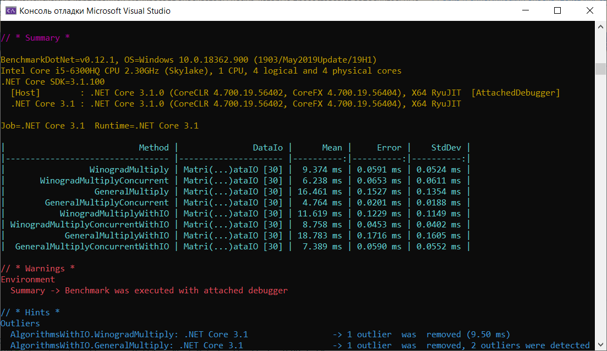
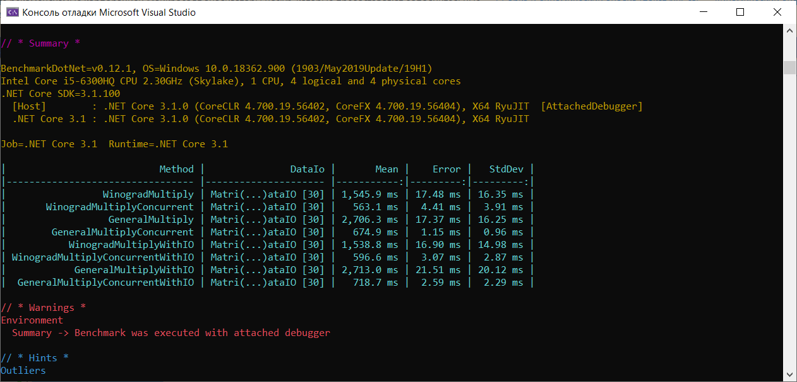
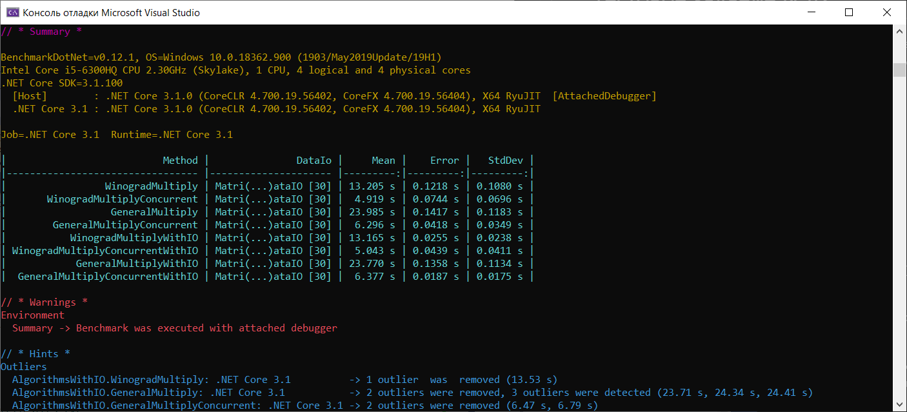
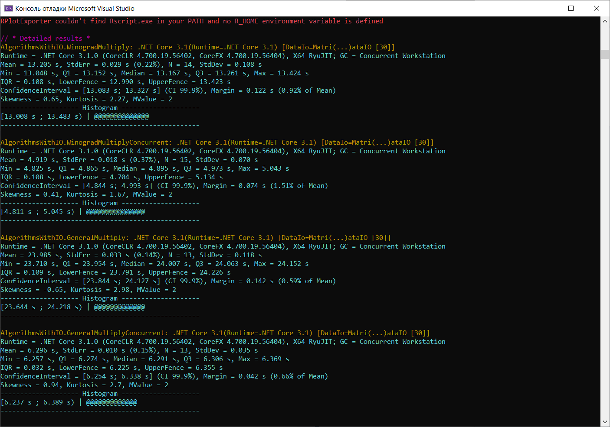
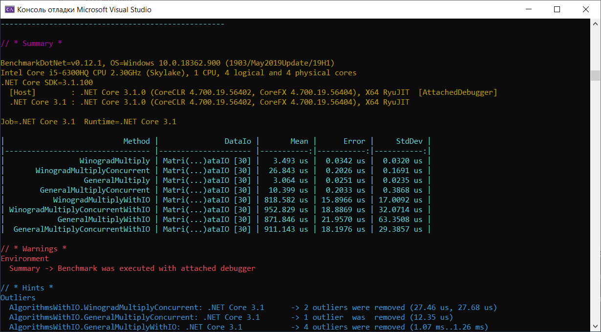
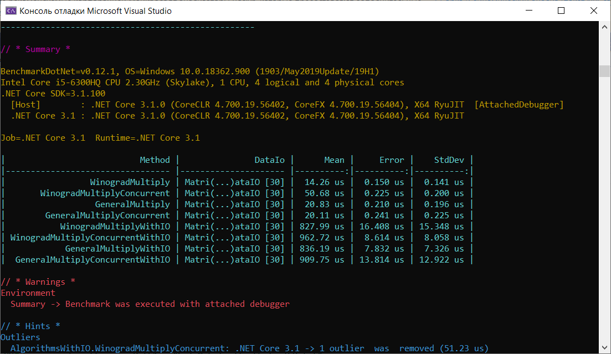
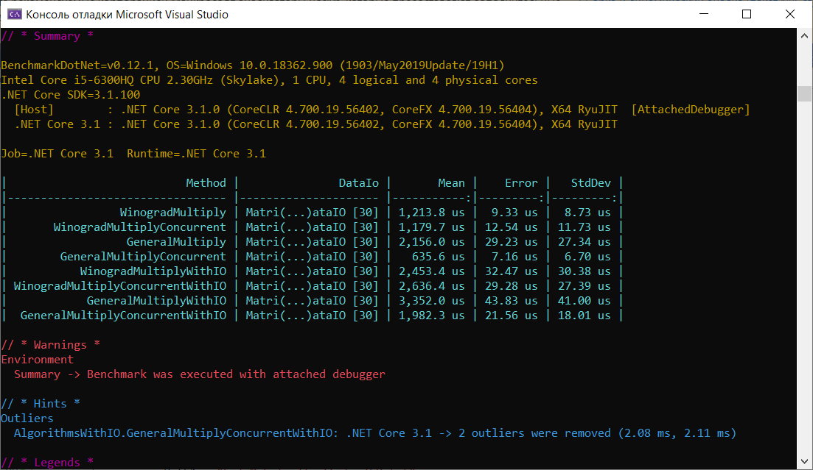

# Тестовое задание №42

Написать функцию для многопоточного перемножения 2 квадратных матриц. Выяснить порог размеров матриц(округлить до 100), при котором многопоточный вариант быстрее однопоточного.

**Платформа .NetCore 3.1**

#### Входные данные
* srcPath1 - имя файла с первой матрцией
* srcPath2 - имя файла со второй матрицей
* dstPath - имя файла с результирующей матрицей

**Формат файлов**

Бинарные файлы, первые 4 байта - размер матрицы N(int32). Следующие `8*N*N байт` - ячейки матрицы (double), записанные слева направо, сверху вниз.

**Бонус(необязательно):** измерить производительность однопоточного и многопотчного вариантов.

- Измерения производительности проводить с помощью библиотеки [BenchmarkDotNet](https://github.com/dotnet/BenchmarkDotNet)
- Измерить 2 варианта: только вычисления и вычисления вместе с вводом/выводом. Для размеров матриц 100, 500, 1000, 5000, 10000
- Результы измерений вставить в README и вместе с проектом положить на гитхаб
- Генератор файлов и однопоточный вариант также положить в проекте рядом.

___
# Результаты выполнения задания

Для анализа времени выполнения переумножения матриц и влияние операций ввода-вывода на скорость работы программы, были выбраны общий алгоритм перемножение 2 матриц с ассимптотикой O(n^3) и алгоритм умножения матриц по Виноградову с ассимптотикой O(n^2.3727). Эти алгоритмы анализируются в однопоточном и многопоточном варианте.

Тесты на матрицах 100х100, 500х500, 1000х1000 показали существенное преимущество многопоточных алгоритмов над однопоточными, а также доказали лучшую ассимптотику работы алгоритма Виноградова, чем общего алгоритма.

### Скриншот работы алгоритмов на матрице 100х100

### Скриншот работы алгоритмов на матрице 500х500

### Скриншот работы алгоритмов на матрице 1000х1000

#### Подробная информация по тестам на матрицах 1000х1000 

### Результаты работы алгоритма на 5000х5000 и 10000х10000

Алгоритм Виноградова в многопоточном варианте перемножает матрицы размером 5000х5000 приблизительно за 12-14 мин. Поэтому считаю не целесообразным (из-за ограниченности по времени) приводить результаты их работы.

Перемножение матриц 10000х10000 занимает часы на имеющейся вычислительной машине, поэтому нет возможности произвести вычисления за адекватный промежуток времени.

## Вывод
Уже на размере матрицы 100х100 заметно преимущество многопоточного вычисления произведения матриц над однопоточным. Поэтому протестируем для матриц размером 5х5, 10х10, 50х50

##### Результаты на матрице 5х5

Заметим, что на самыми быстрым алгоритмом на маленьких матририцах является однопоточный общий алгоритм. Это связано с отсутствием необходимых расходов на выделение дополнительной памяти (алгоритм Виноградова) и управления задачами

##### Результаты на матрице 10х10

Результаты похожи на 5х5. Также использование сложных алгоритмов и многопоточки не оправдано

##### Результаты на матрице 50х50

Уже на матрице 50х50 заметен выигрыш в использовании дополнительной памяти в алгоритме Виноградова и распараллеливание вычислений

